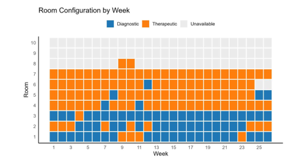
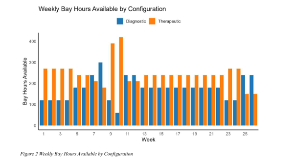
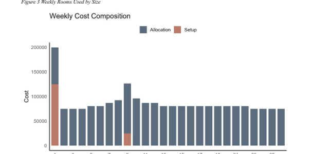
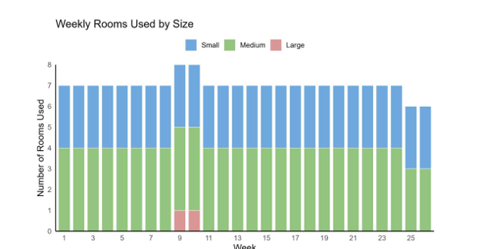

# Hospital Capacity Planning and Optimisation

## Snapshot

**Business question:** How should a hospital GI unit configure procedure rooms each week to meet diagnostic and therapeutic demand at minimum cost?

**Recommendation:** Use an optimised 26-week room configuration plan that balances diagnostic capacity, therapeutic capacity, clinician availability, setup costs, and room allocation costs.

**Planning horizon:** 26 weeks

**Resources:** 10 procedure rooms

**Tools:** R, ompr, ROI, HiGHS solver, ggplot2

**Methods:** Mixed-integer linear programming, capacity planning, setup-cost modelling, constraint optimisation, solver validation, feasibility checking

**Output:** Portfolio case study report, R optimisation code, visual operating plan, cost and feasibility analysis

---

## Why This Project Matters

Hospitals often face pressure to meet patient demand while working within limited room, staffing, and budget constraints. In a GI unit, procedure rooms may need to support both diagnostic and therapeutic activity, but rooms differ in size, capacity, and cost.

This project uses optimisation modelling to support a practical healthcare planning decision: how to configure rooms each week so that all required procedures are covered while avoiding unnecessary operating cost.

The project demonstrates how mathematical optimisation can support hospital capacity planning, resource allocation, and operational decision-making.

---

## What I Did

* Built a mixed-integer linear programming model for a hospital GI unit capacity planning problem.
* Modelled weekly diagnostic and therapeutic procedure demand over a 26-week planning horizon.
* Represented 10 procedure rooms with different size profiles, capacities, allocation costs, and setup costs.
* Added constraints to ensure each room could only be assigned one configuration per week.
* Ensured all diagnostic and therapeutic demand was met each week.
* Included clinician availability constraints to keep the plan operationally feasible.
* Modelled setup costs when rooms were activated after being unavailable.
* Solved the MILP in R using the HiGHS solver.
* Produced visual outputs showing the weekly room plan, available capacity, room-size mix, and weekly cost structure.
* Validated the final solution using solver output, total cost checks, and weekly feasibility checks.

---

## Key Metrics

* **10** procedure rooms modelled
* **26-week** planning horizon
* **2** procedure types: diagnostic and therapeutic
* **3** room size profiles: small, medium, and large
* **2,265,600** minimum total cost
* **87,138** average weekly cost
* **2,115,600** total allocation cost
* **150,000** total setup cost
* **8** total room setups
* **7** average rooms used per week
* **0.00883%** MILP optimality gap
* **100%** weekly diagnostic demand met
* **100%** weekly therapeutic demand met
* **0** clinician capacity violations

---

## Business Problem

The GI unit needed to decide how to configure procedure rooms each week across a 26-week planning period.

Each room could be configured for:

* Diagnostic procedures
* Therapeutic procedures
* Unavailable status

The challenge was to meet all weekly diagnostic and therapeutic demand while respecting clinician availability and minimising the combined cost of room allocation and room setup.

The central business question was:

**How can the hospital meet all required procedure demand at the lowest operating cost while using rooms and clinician capacity efficiently?**

---

## Analytical Approach

The project followed an optimisation-based business analytics workflow.

### 1. Problem Definition

The planning problem was defined as a weekly room configuration decision. The model needed to determine which rooms should be used for diagnostic activity, which rooms should be used for therapeutic activity, and which rooms could remain unavailable in each week.

### 2. Data and Parameters

The model used:

* Weekly diagnostic procedure demand
* Weekly therapeutic procedure demand
* Weekly clinician availability
* Room size categories
* Diagnostic room capacity
* Therapeutic room capacity
* Room allocation costs
* Room setup costs

Rooms were grouped into small, medium, and large profiles, each with different capacity and cost characteristics.

### 3. Decision Variables

The model included binary decision variables to identify whether each room was configured for diagnostic or therapeutic use in each week.

It also included continuous variables for diagnostic and therapeutic hours scheduled in each room, and binary setup variables to capture whether a setup cost was incurred.

### 4. Objective Function

The objective was to minimise total cost across the 26-week planning horizon.

Total cost included:

* Weekly room allocation cost
* Setup cost when rooms were activated

### 5. Constraints

The model included constraints to ensure:

* Each room has at most one configuration per week
* Diagnostic demand is met every week
* Therapeutic demand is met every week
* Total scheduled hours do not exceed clinician availability
* Therapeutic hours are only assigned to therapeutically configured rooms
* Room hours stay within the capacity of the selected configuration
* Setup costs are only charged when rooms are activated after being unavailable
* Scheduled hours are non-negative

### 6. Solver Validation

The model was solved using the HiGHS MILP solver in R. The final solution reached a relative optimality gap of **0.00883%**, confirming that the solution was optimal within the solver tolerance.

---

## Key Findings

### 1. The hospital can meet all demand at a minimum total cost of 2,265,600

The optimisation model produced a 26-week configuration plan that met all diagnostic and therapeutic demand at a total cost of **2,265,600**.

This provides a clear cost-minimising operating plan for the GI unit.

### 2. The average weekly operating cost is 87,138

Across the 26-week horizon, the average weekly cost was **87,138**. This includes both ongoing allocation costs and setup costs.

The cost profile shows that most operating cost is driven by room allocation, while setup costs are concentrated in specific activation weeks.

### 3. The model uses an average of seven rooms per week

The plan uses an average of **seven rooms per week**, rather than activating all ten rooms continuously. This supports efficient capacity use by keeping unnecessary rooms unavailable when demand can be met without them.

### 4. Large rooms are only used in selected higher-demand weeks

The weekly room-size analysis shows that the model relies mainly on small and medium rooms. Large rooms are only brought into use when demand increases enough to justify their higher cost.

This shows the model is not simply maximising capacity. It is choosing the lowest-cost feasible mix of rooms.

### 5. Setup costs are controlled by keeping active rooms stable

Setup costs occur mainly in week 1, when rooms are first activated, and again in week 9, when additional capacity is required.

This indicates that the model avoids unnecessary switching between active and inactive room states.

### 6. Feasibility checks confirm the plan is operationally valid

The weekly validation confirms that diagnostic and therapeutic demand are met in every week and clinician availability is not exceeded.

This makes the model useful as a practical planning tool, not only a cost calculation.

---

## Analytical Outcomes and Decision Value

This project translated a complex hospital capacity planning problem into a structured optimisation model.

The analysis helped to:

* Identify the lowest-cost room configuration plan
* Match diagnostic and therapeutic demand with available room capacity
* Control setup costs by avoiding unnecessary room activation
* Respect clinician availability limits
* Understand when higher-cost large rooms are actually needed
* Produce a week-by-week operating plan for management
* Validate that the recommended solution is feasible and cost-efficient

The decision value is not only the final cost figure. The project demonstrates how optimisation can support healthcare managers by turning capacity, staffing, and cost constraints into a clear operating plan.

---

## Business Recommendations

### 1. Use the 26-week optimisation plan as the baseline room configuration schedule

The model provides a week-by-week plan showing which rooms should be diagnostic, therapeutic, or unavailable. This can support management planning and reduce ad hoc room allocation decisions.

### 2. Keep unnecessary rooms unavailable when demand can be met without them

The model shows that all ten rooms do not need to be active every week. Maintaining an average of seven active rooms helps meet demand while avoiding unnecessary allocation cost.

### 3. Use large rooms selectively during higher-demand weeks

Large rooms carry higher weekly cost. The model only activates them in selected weeks when demand requires additional capacity. This supports a cost-conscious approach to capacity planning.

### 4. Monitor setup costs when changing room availability

Setup costs are triggered when rooms move from unavailable to active use. Management should avoid unnecessary room activation and instead maintain stable room usage where possible.

### 5. Use feasibility checks before implementing weekly schedules

Each weekly schedule should be checked against diagnostic demand, therapeutic demand, and clinician availability. This ensures the plan remains operationally realistic.

### 6. Extend the model for uncertainty in future work

The current model is deterministic. Future versions could include demand uncertainty, cancellations, urgent cases, staffing variation, or scenario testing to support more robust hospital planning.

---

## Key Visuals

### Room Configuration by Week



**Business takeaway:** The optimisation model produces a clear 26-week operating plan showing which rooms should be configured for diagnostic activity, therapeutic activity, or left unavailable.

### Weekly Capacity by Configuration



**Business takeaway:** The recommended plan provides enough diagnostic and therapeutic bay-hour capacity to meet weekly demand across the full planning horizon.

### Weekly Cost Composition



**Business takeaway:** Setup costs are mainly concentrated in week 1 and week 9, while allocation costs form the ongoing weekly operating cost.

### Weekly Rooms Used by Size



**Business takeaway:** The model relies mainly on small and medium rooms, using large rooms only in selected higher-demand weeks to avoid unnecessary cost.

---

## Report

The full portfolio case study report is available in the `report/` folder:

[View Portfolio Case Study Report](report/Hospital-Capacity-Planning-Portfolio-Case-Study.pdf)

---

## Repository Structure

```text
code/        R optimisation code and analysis scripts
visuals/     Key charts and model output visuals
report/      Portfolio case study report
data/        Data notes or sample data information
```

---

## Project Status

Completed as part of my MSc Business Analytics portfolio.
